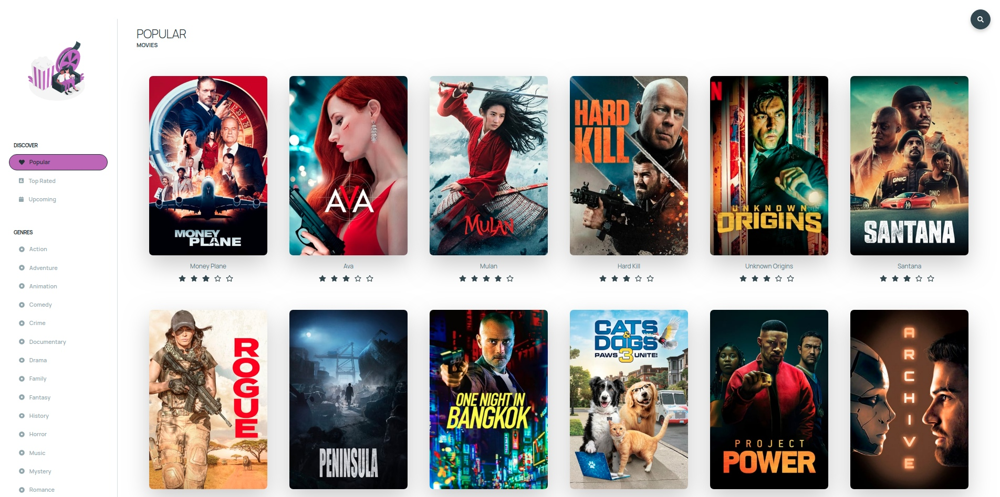

# Movie App

## [Watch it live](https://gulevskydev-movie.netlify.app/)

This project uses the [ The Movie Database (TMDb)](https://www.themoviedb.org/)



## You can clone it and run:

```bash
npm install
npm run start
```

This will start a live-server with the project running. Dont forget to create a .env file

```bash
REACT_APP_API_KEY = yourapikey
```
